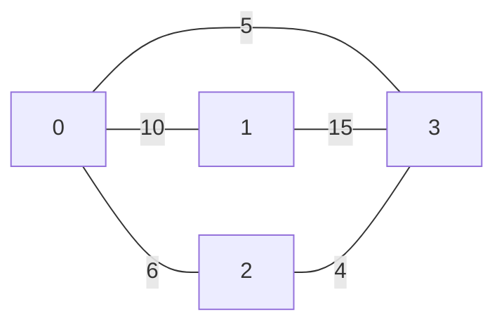
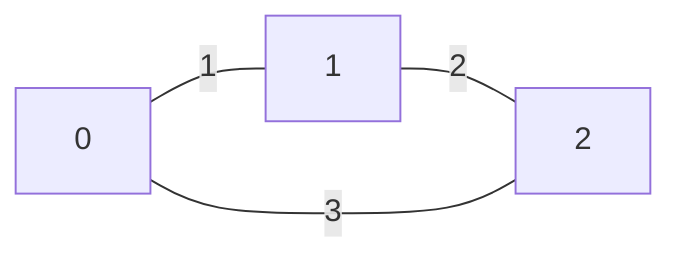
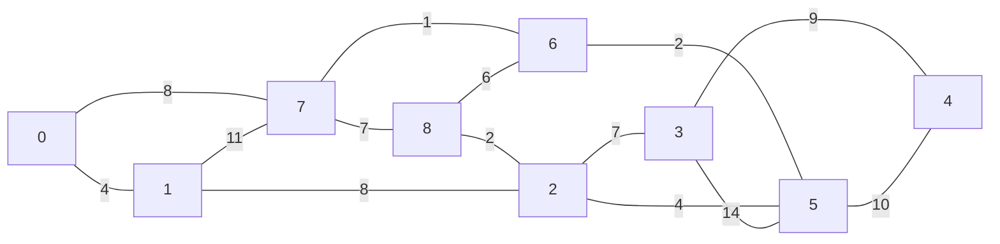

# Universidade Federal de Ouro Preto PCC104
## Projeto e Análise de Algoritmos 
### Diminuir e Conquistar Prof. Rodrigo Silva 
### November 25, 2024
## Instruções 
- Para cada conjunto de algoritmos o aluno deve escolher um.
- O aluno deve criar um repositório público no github com todos os códigos desenvolvidos. 
- Em cada implementação o aluno deve: 
  - Apresentar 3 casos de teste 
  - Estar preparado para desenvolver a análise de custo 
  - Estar preparado para responder perguntas sobre o seu próprio código, sobre o algoritmo e sobre o problema que o algoritmo resolve
## Requisitos
Será necessário o pacote pytest ([link](https://docs.pytest.org/en/stable/index.html)) para executar os testes
## Conjunto 1 - Dividir e Conquistar
1. Implemente o algoritmo MergeSort ([link](./conjuntos/conjunto1.py)).
## Conjunto 2 - Programação Dinâmica
1. Implemente os dois algoritmos baseados em programação dinâmica para o problem da mochila ([link](./conjuntos/conjunto2.py)).
## Conjunto 3 - Algoritmos Gulosos
2. Implemente o algorimo de Kruskall ([link](./conjuntos/conjunto3.py)).
### Caso 0

### Caso 1

### Caso 2

### Caso 3
